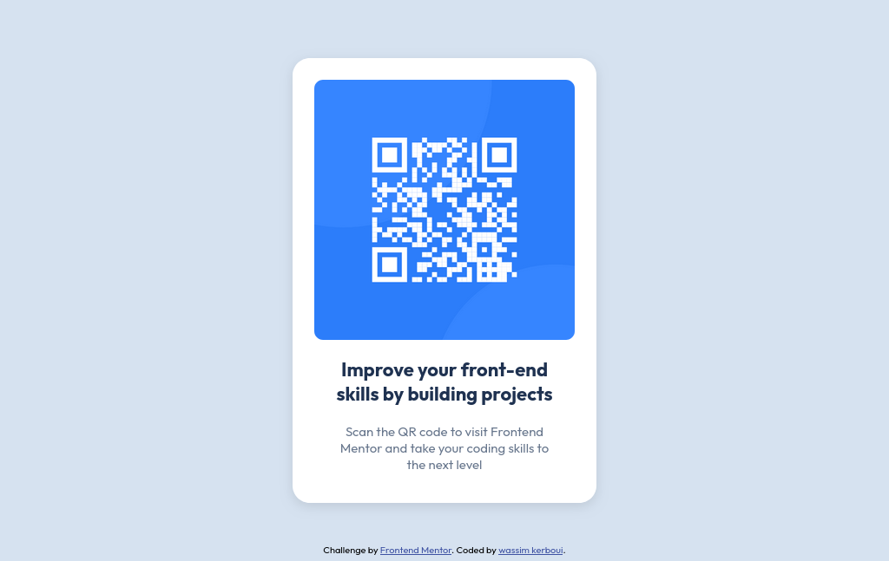

# Frontend Mentor - QR code component solution

This is a solution to the [QR code component challenge on Frontend Mentor](https://www.frontendmentor.io/challenges/qr-code-component-iux_sIO_H). Frontend Mentor challenges help you improve your coding skills by building realistic projects. 

## Table of contents

- [Frontend Mentor - QR code component solution](#frontend-mentor---qr-code-component-solution)

    - [Screenshot](#screenshot)
    - [Built with](#built-with)
    - [Continued development](#continued-development)
    - [Useful resources](#useful-resources)
  - [Author](#author)
  - [Acknowledgments](#acknowledgments)

### Screenshot

### Built with

- Semantic HTML5 markup
- CSS custom properties
- Flexbox

### Continued development

I realized how bad i am at coding, So... i am gonna continue coding until I become good at it!  

### Useful resources

- [w3shools css](https://www.w3schools.com/css/default.asp) - This helps for css

also huge shoutout for my boy chatgpt.

## Author

- Website - [Add your name here](https://www.your-site.com)
- Frontend Mentor - [@qzwas](https://www.frontendmentor.io/profile/qzwas)

## Acknowledgments

first off all, i would like to thank myself, and thats everybody.

